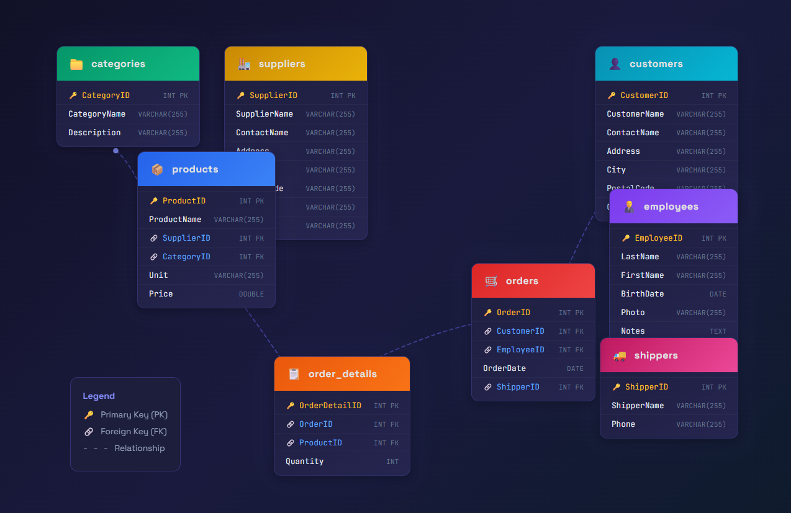

# SQLite Chat Agent

A beautiful AI-powered chat interface to query your SQLite database using natural language. Built with React frontend and Python LangChain/OpenAI backend.


## Demo Video

Watch how to use the SQLite Chat Agent:

https://github.com/user-attachments/assets/72aa1c89-ff62-4c1f-8f27-e2259e2f8517

## Features

- 💬 **Natural Language Queries**: Ask questions about your database in plain English
- 🤖 **AI-Powered SQL Generation**: Uses OpenAI GPT to understand and generate SQL queries
- 📊 **Schema Viewer**: View your database structure at a glance
- 🎨 **Modern Dark UI**: Beautiful terminal-inspired interface with smooth animations
- ⚡ **Real-time Results**: See generated SQL queries and raw data output

## Database Schema



## Project Structure

```
agent-chat-with-sqliteDB/
├── backend/
│   ├── main.py          # FastAPI server
│   ├── agent.py         # LangChain SQL agent
│   └── requirements.txt # Python dependencies
├── frontend/
│   ├── src/
│   │   ├── components/  # React components
│   │   ├── App.jsx      # Main application
│   │   └── index.css    # Global styles
│   ├── package.json     # Node dependencies
│   └── vite.config.js   # Vite configuration
├── db/
│   └── data.sqlite      # Your SQLite database
├── schema.png           # Database schema diagram
├── howto.mp4            # Tutorial video
└── README.md
```

## Prerequisites

- Python 3.9+
- Node.js 18+
- OpenAI API key

## Setup Instructions

### 1. Backend Setup

```bash
# Navigate to backend directory
cd backend

# Create virtual environment
python -m venv venv

# Activate virtual environment
# On Windows:
venv\Scripts\activate
# On macOS/Linux:
source venv/bin/activate

# Install dependencies
pip install -r requirements.txt

# Create .env file with your OpenAI API key
echo OPENAI_API_KEY=your_openai_api_key_here > .env
```

### 2. Frontend Setup

```bash
# Navigate to frontend directory
cd frontend

# Install dependencies
npm install
```

### 3. Running the Application

**Start the Backend (Terminal 1):**
```bash
cd backend
# Activate venv if not already active
venv\Scripts\activate  # Windows
# or: source venv/bin/activate  # macOS/Linux

# Run the server
python main.py
```
The backend will start at http://localhost:8000

**Start the Frontend (Terminal 2):**
```bash
cd frontend
npm run dev
```
The frontend will start at http://localhost:5173

### 4. Open the Application

Visit **http://localhost:5173** in your browser.

## Usage

1. **Ask Questions**: Type natural language questions about your database in the chat
2. **View Results**: See the AI-generated answer on the left, with SQL query and raw data on the right
3. **Explore Schema**: Click the "Schema" tab to view your database structure

### Example Questions

- "What tables are in this database?"
- "Show me all records from the users table"
- "How many rows are in each table?"
- "What are the column names in the orders table?"
- "Find all users who signed up in the last month"

## API Endpoints

| Method | Endpoint | Description |
|--------|----------|-------------|
| GET | `/` | Health check |
| GET | `/health` | API health status |
| GET | `/schema` | Get database schema |
| POST | `/query` | Query database with natural language |

## Configuration

### Environment Variables

Create a `.env` file in the `backend/` directory:

```env
OPENAI_API_KEY=sk-your-openai-api-key-here
```

### Changing the Database

Replace `db/data.sqlite` with your own SQLite database file. The agent will automatically detect the schema.

## Tech Stack

**Frontend:**
- React 18
- Vite
- Framer Motion
- Axios

**Backend:**
- FastAPI
- LangChain
- OpenAI GPT-4
- SQLAlchemy
- Python-dotenv

## Troubleshooting

### Backend won't start
- Ensure Python 3.9+ is installed
- Check that all dependencies are installed
- Verify your OpenAI API key is valid

### Frontend can't connect to backend
- Ensure backend is running on port 8000
- Check CORS settings if using a different port
- Verify no firewall blocking the connection

### No results returned
- Check that your SQLite database exists at `db/data.sqlite`
- Verify the database has tables with data
- Check the console for error messages

## License

MIT License - feel free to use this project for your own purposes.
